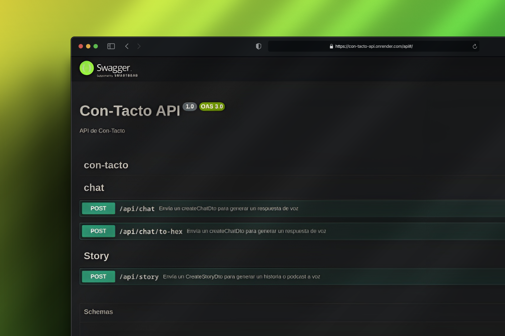
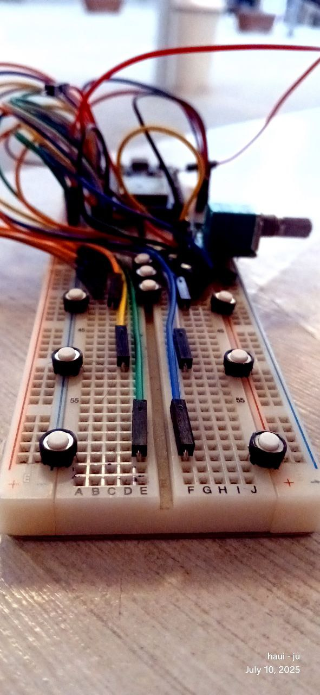

<p align="center" style="display: flex; gap: 10px; flex-wrap: wrap; justify-content: center">
  
  
</p>

<p align="center">
  
  
  
  
</p>

---

# 🌟 Con-tacto API – Backend

**Con-tacto** es una respuesta innovadora en desarrollo, que busca que las personas con DSI puedan tocar el mundo a través del braille, combinamos un hardware táctil con inteligencia artificial y síntesis de voz. A través del módulo SP39, cada pulsación en braille se convierte en una respuesta de audio, abriendo paso al diálogo con familiares, amigos y asistentes naturales o virtuales.

> **Este repositorio es el backend de Con-tacto.**  
> El hardware SP39 detecta pulsaciones en braille y las traduce a texto.  
> La API recibe ese texto, lo procesa con IA, lo convierte a audio (WAV) mediante TTS y lo retorna al usuario.

---

## ¿Qué hace Con-tacto?

- **Entrada:** El módulo SP39 (hardware) detecta pulsaciones en braille y las traduce a texto.
- **Comunicación:** El texto llega a esta API (NestJS), que lo procesa y lo envía a un modelo de IA.
- **Respuesta:** La IA genera una respuesta contextual.
- **Audio:** La respuesta se sintetiza a voz (WAV) usando TTS y se retorna al usuario.
- **Interacción:** Permite el diálogo entre usuarios, familiares, amigos y asistentes (naturales o virtuales).

---

## 🧩 Componentes principales

- **API REST & WebSocket:** Endpoints y canales en tiempo real para interacción usuario-tutor.
- **Módulo de Chat:** Envía mensajes y recibe respuestas de IA, convertidas a audio.
- **Módulo de Historias:** Genera historias/podcasts personalizados con IA y los convierte a audio.
- **Síntesis de Voz (TTS):** Modelos multilingües y configurables ([`VoiceModels`](src/tts/VoiceModels.ts)), ajustando volumen, tono y velocidad.
- **Swagger:** Documentación interactiva en `/api`.

---

## 🗂️ Estructura del proyecto

- [`src/app.module.ts`](src/app.module.ts): Módulo raíz que integra los submódulos principales.
- [`src/chat/`](src/chat/): Lógica de chat, controladores y DTOs para mensajes y respuestas de voz.
- [`src/story/`](src/story/): Generación de historias/podcasts personalizados.
- [`src/socket/`](src/socket/): Comunicación en tiempo real vía WebSocket.
- [`src/tts/`](src/tts/): Modelos y servicio de síntesis de voz.
- [`src/ai/`](src/ai/): Lógica de IA para generación de texto y prompts personalizados.

---

## Instalación y uso

### Clone el repositorio

```shell
git clone git@github.com:Luis-Fernando-MP/con-tacto-api.git
```

### 🚀 Instale y ejecute

```shell
pnpm install
pnpm run start
```

- Accede a la documentación en: http://127.0.0.1:3000/api
- El frontend de ejemplo está en [`./index.html`](index.html) (interacción usuario-tutor en tiempo real).

# Recursos útiles

- [NestJS Documentation](https://docs.nestjs.com/)
- [Con-tacto Hardware SP39](https://github.com/tuusuario/con-tacto) <!-- cambia por tu URL real -->
- [@andresaya/edge-tts](https://www.npmjs.com/package/@andresaya/edge-tts)

# 📝 Licencia

Nest está bajo licencia [MIT](https://opensource.org/licenses/MIT).
